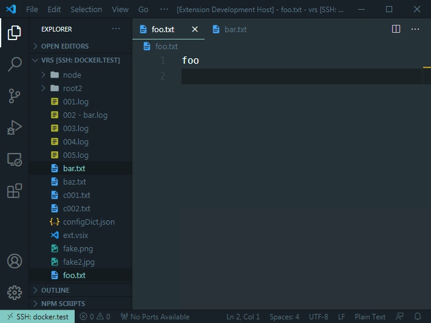
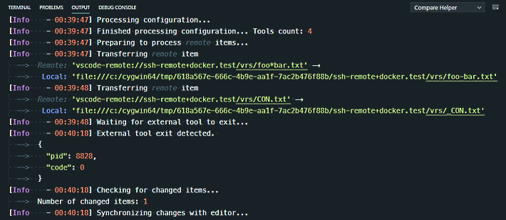

# Change Log

All notable changes to the "Compare Helper" extension will be documented in this file.

Check [Keep a Changelog](http://keepachangelog.com/) for recommendations on how to structure this file.

## [Unreleased]
<!-- ## [1.1.0] - 2020-12-11 -->
### Added

- Remote Development support
    
  - Remote `Text` files
    
    Comparison is possible, changes made by external tools are synced back with `editor`.

  - Remote `Image` files

    Comparison is possible, but changes are **ignored**. Further releases will feature an option to transfer changed images back to the original remote location.

  - Remote `Folders`

    Comparison is not possible.

  
  
  

## [1.0.0] - 2020-11-22

- Initial release

[Unreleased]: https://github.com/keewek/vscode-compare-helper/compare/v1.0.0...HEAD
[1.1.0]: https://github.com/keewek/vscode-compare-helper/releases/tag/v1.1.0
[1.0.0]: https://github.com/keewek/vscode-compare-helper/releases/tag/v1.0.0
