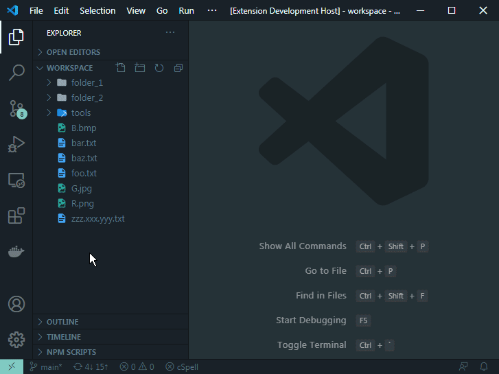
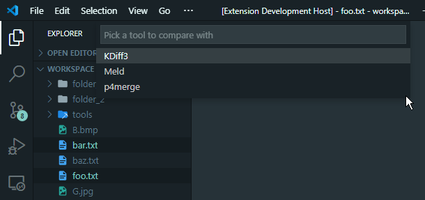

# Compare Helper

Compare files or folders via configured external tools.



## Features

Extension adds a new submenu `Compare (External)`


- `Compare`

    Compares selected items with the configured default tool.

- `Compare With...`

    Shows a tool selection GUI and compares selected items with the chosen tool. Tools are filtered by item's kind.

    

## Requirements

Extension is fully dependent upon installed external tools. Configure them as needed in the Extension's Settings.

## Extension Settings

This extension contributes the following settings:

- `compareHelper.defaultExternalTools`: default tools to use 

    For example:

    ```json
    "compareHelper.defaultExternalTools": {
        "folders": "FreeFileSync",
        "images": "p4merge",
        "text": "bbdiff"
    }
    ```
    | Property | Type     | Optional | Default | Description
    | -------- | -------- | :------: | :-----: | ------------
    | folders  | string   |    ✔     |   ''    | Default tool for folders
    | images   | string   |    ✔     |   ''    | Default tool for images
    | text     | string   |    ✔     |   ''    | Default tool for text

    > Use the value of the tool's `name` property.

- `compareHelper.externalTools`: external tools configuration

    For example:

    ```jsonc
    "compareHelper.externalTools": [
        {
            "name": "bbdiff",
            "path": "bbdiff",
            "args": [
                "--text-files-only",
                "${FOLDER_ITEM_1}",
                "${FOLDER_ITEM_2}"
            ],
            "compares": [
                "text",
                "folders"
            ]
        },
        {
            "name": "p4merge",
            "path": "/Applications/p4merge.app/Contents/MacOS/p4merge",
            "args": [
                "${FOLDER_ITEM_1}", // base / left
                "${FOLDER_ITEM_2}", // left / right
                "${FOLDER_ITEM_3}", // right
                "${FOLDER_ITEM_4}"  // merge
            ],
            "compares": [
                "text",
                "images"
            ]
        }
    ]
    ```

    | Property | Type                 | Optional | Default                       | Description 
    | -------- | ---------------------| :------: | :---------------------------: | ------------ 
    | name     | string               |          |                               | Used in GUI and as ID for default settings. Must be a unique value
    | path     | string               |          |                               | Absolute or relative path to the executable
    | args     | (string \| args)[]   |    ✔     |           *SPECIAL*           | See [Args](#Args) bellow
    | compares | string[]             |    ✔     | ['folders', 'images', 'text'] | Specifies what kind of items a tool can handle. Allowed values: "folders", "images", "text"
    
    > ### Args
    > 
    > When args array is empty or missing all selected items are used as args, one item per argument.
    >
    > The following template `${FOLDER_ITEM_n}` where n ≥ 1 can be used to refer to the selected item. Items are in click order.
    >
    > An **entire arg** is ignored when template refers to an item out of range.
    >
    > For example:
    >
    > ```jsonc
    > [
    >     "${FOLDER_ITEM_1}", // base / left
    >     "${FOLDER_ITEM_2}", // left / right
    >     "${FOLDER_ITEM_3}", // right
    >     "${FOLDER_ITEM_4}"  // merge
    > ]
    > ```
    > 
    > With only two selected items args will be `["path/to/item/1", "path/to/item/2"]`
    > 
    > ### Nested Args
    >
    > Arguments could be nested. An **entire nested arg and all its children** is ignored when template refers to an item out of range.
    >
    > For example:
    >
    > ```jsonc
    > [
    >     "${FOLDER_ITEM_1}",     // base / left
    >     "${FOLDER_ITEM_2}",     // left / right
    >     "${FOLDER_ITEM_3}",     // right
    >     [
    >         "--out",
    >         "${FOLDER_ITEM_4}", // Output file
    >         [
    >             "-L", "Label for Base",
    >             "-L", "Label for Left",
    >             "-L", "Label for Right",
    >         ]
    >     ]
    > ]
    > ```
    >
    > With only two selected items args will be `["path/to/item/1", "path/to/item/2"]`
    >
    > With four selected items args will be flatten to:
    > 
    > ```json
    > [
    >     "path/to/item/1",
    >     "path/to/item/2",
    >     "path/to/item/3",
    >     "--out",
    >     "path/to/item/4", 
    >     "-L", 
    >     "Label for Base",
    >     "-L",
    >     "Label for Left",
    >     "-L",
    >     "Label for Right",
    > ]
    > ```


### Example configurations:

- [Windows](docs/config.win.jsonc)
- [OS X](docs/config.osx.jsonc)

## Known Issues

- Keybindings

    Triggering `Compare`, `Compare With...` commands via keybindings doesn't work.

    Due to API limitation, current selection in `Explorer` view is passed to command only if such command is triggered via context menu.

- Remote Development

    Current version doesn't support Remote Development mode.

## Latest Version

### 1.0.0

Initial release

See [CHANGELOG.md](CHANGELOG.md) for complete release notes.

## Acknowledgements

- Fonts by [Font Awesome Free](https://github.com/FortAwesome/Font-Awesome)

<!-- ### -->
